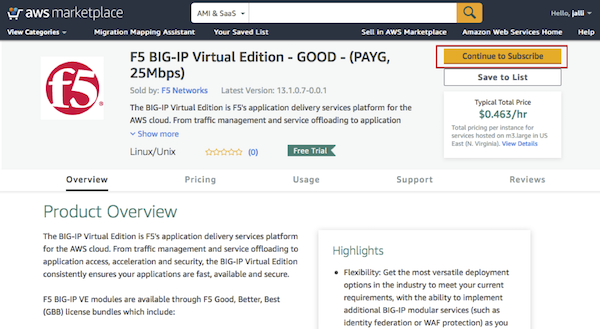
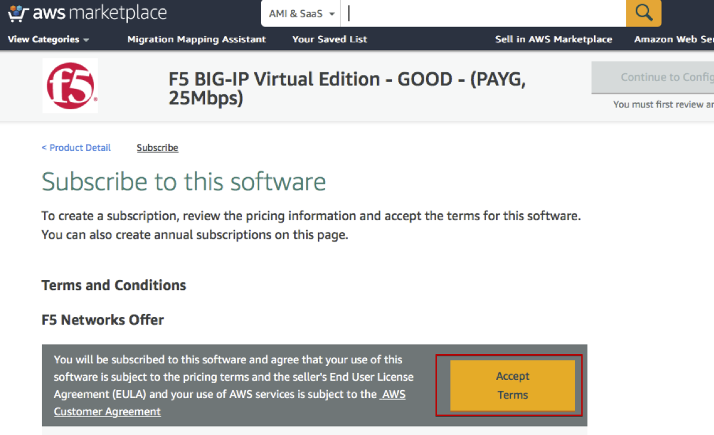

# SEhot

AWS Hands-on Training
======== 

Aug2018

Pre-requisities:
1. Create free AWS account. This requires valid personal email, mobile number, and credit card.
   https://aws.amazon.com/resources/create-account/
   The lab is not designed to run on the shared corporate account.
2. Once your account is active (should take a few minutes)
   - Create your keypair and store the PEM file locally and securely
   - Launch any T2.micro linux EC2 instance, see that it launches successfully 

Lab steps:
1. Accept the terms and conditions for the F5 marketplace AMI we are using 
   
2. 

