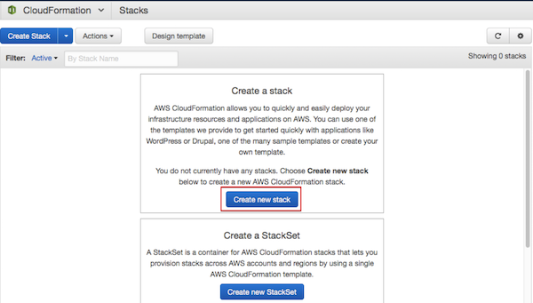
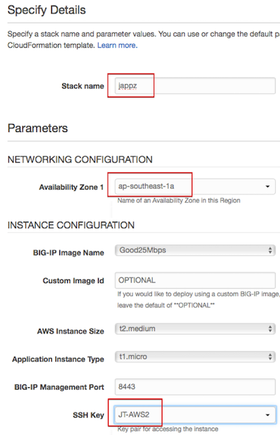

# SEhot

AWS Hands-on Training
======== 

Aug2018

Pre-requisities:
1. Create free AWS account. This requires valid personal email, mobile number, and credit card.
   https://aws.amazon.com/resources/create-account/  
   This lab is not designed to run on the shared corporate account.
2. Once your account is active (should take a few minutes)
   - Create your keypair and store the PEM file locally and securely  
     http://docs.aws.amazon.com/AWSEC2/latest/UserGuide/ec2-key-pairs.html
   - Launch any T2.micro linux EC2 instance, see that it launches successfully   
     https://docs.aws.amazon.com/AWSEC2/latest/UserGuide/EC2_GetStarted.html#ec2-launch-instance

---

Lab steps:
1. Click to subscribe to the F5 marketplace AMI we are using and then accept the terms.  
   F5 BIG-IP Virtual Edition - Good - PAYG, 25M
   

2. Download a local copy of the lab CFT    
   [https://raw.githubusercontent.com/jonxly/SEhot/master/JT-fullstack-payg-1nic-bigip_jul18.template](https://raw.githubusercontent.com/jonxly/SEhot/master/JT-fullstack-payg-1nic-bigip_jul18.template)

3. Go to AWS CloudFormation and create a new template  
   Select "Upload a template to Amazon S3", and select the CFT you just downloaded
   

4. Fill in the parameters for the CFT  
   Most are prepopulated here  
   

5. Chill or chitchat for **8 minutes** while the template does the heavy lifting

6. Check the CFT outputs  
   Specifically those highlighted below:  
   

7. Access the backend website via BIG-IP. Hint: Bip1subnet1Az1SelfEipAddress  
   Check your CFT events for errors or shout for help if it does not load
    

8. Check Access to F5 UI via Bigip1Url
   Check your CFT events for errors or shout for help if it does not load

9. Set the BIG-IP admin password and then login  
   [https://clouddocs.f5.com/cloud/public/v1/aws/AWS_singleNIC.html#awssingleadmin](https://clouddocs.f5.com/cloud/public/v1/aws/AWS_singleNIC.html#awssingleadmin)

10. Poke around TMUI like-a-pro, view Network Map, Pool network stats etc  
    

11. Simulate a catastophic outage.    
    Simple suggestion is to go into AWS EC2 dashboard and stop your Webserver instance  
    Confirm that the website is no longer available  

12. Now Lets fix things.  
    Create an Application Service based on the Service Discovery iApp with the following config  
    

13. Go back to EC2 dashboard, select your webserver instance > "Launch More Like This"  
    Repeat to launch as many as you like (or can afford).

14. Go into TMUI to see the app self-heal!  
    Simple yet awesome :)

---

15. **Teardown**
    - a. Terminate all webserver instances from the EC2 dashboard
    - b. Go to CloudFormation and select "Delete Stack"
    - c. check EC2 and billing dashboards before logging out
    - d. Submit any **lab related** charges in Concur